# Contact Center Forecast

Sample project forecasting contact center call volume from synthetic data, and translating the forecast into a staffing estimate (Erlang C). Includes a Streamlit dashboard and a teaching notebook that walks through the forecasting methodology from first principles.

## Run

```bash
pip install -r requirements.txt
python generate_synthetic_data.py
streamlit run app.py
```

To open the notebook instead:

```bash
jupyter notebook Forecasting_Notebook_Baliber.ipynb
```

## What it shows

**Dashboard (`app.py`)** — synthetic daily call volume + AHT (Average Handle Time) for one queue, with weekly/yearly seasonality, trend, and injected spike days. Runs a live 5-fold walk-forward backtest (Seasonal Naive vs. Holt-Winters) on every load and recommends whichever method has the lower backtest error, instead of a neutral toggle — the method selector still lets you inspect the runner-up. Shows the head-to-head MAE/MAPE, an Erlang C staffing estimate with a cost comparison between what each method would imply, a what-if slider to override the recommended headcount, and one-line callouts for the AHT-under-load correlation and the injected spike days (which no forecasting method here could have predicted from history alone).

**Notebook (`Forecasting_Notebook_Baliber.ipynb`)** — a from-first-principles walkthrough at half-hourly granularity, 3 years of synthetic history: dataset exploration, time series decomposition (trend/seasonality/residual, autocorrelation, stationarity), three forecasting methods (seasonal naive, simple exponential smoothing, Holt-Winters) compared with error metrics and walk-forward backtesting, the Erlang C formula derived step by step, and a cost comparison between staffing plans.

## Data

`generate_synthetic_data.py` writes `data/calls_intraday.csv` (half-hourly, 3 years, ~52.5k rows) and `data/calls.csv` (its daily aggregate, used by the dashboard).

## Notebook highlights

Figures exported from `Forecasting_Notebook_Baliber.ipynb` (see `plots/`):

| | |
|---|---|
| 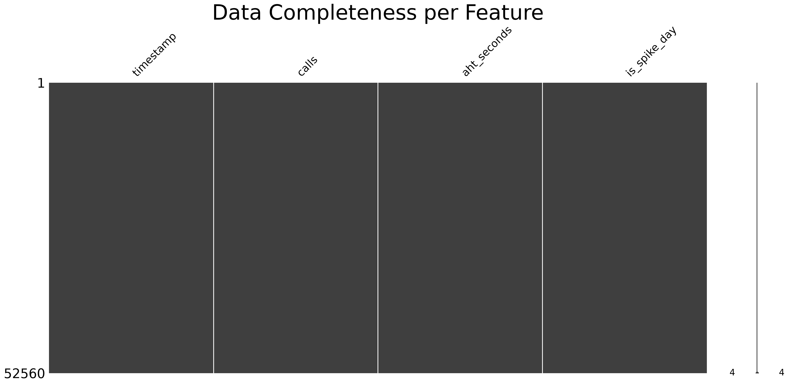 | 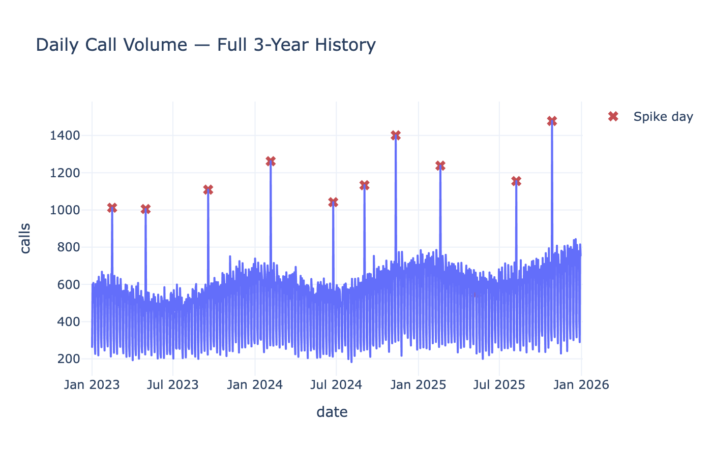 |
| 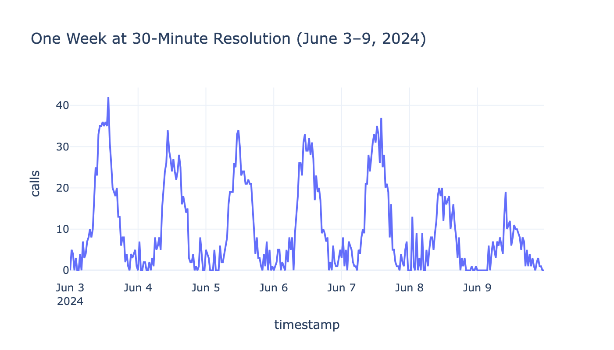 | 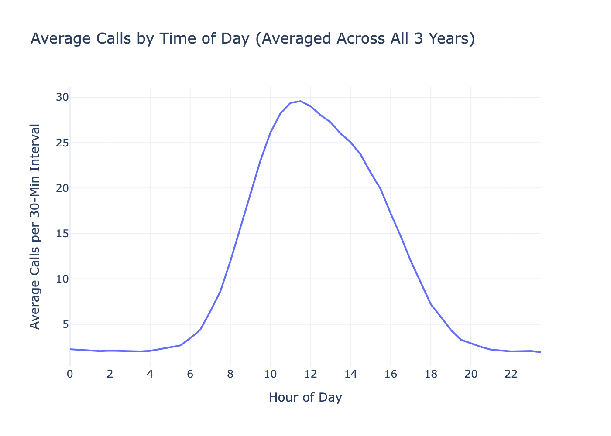 |
| 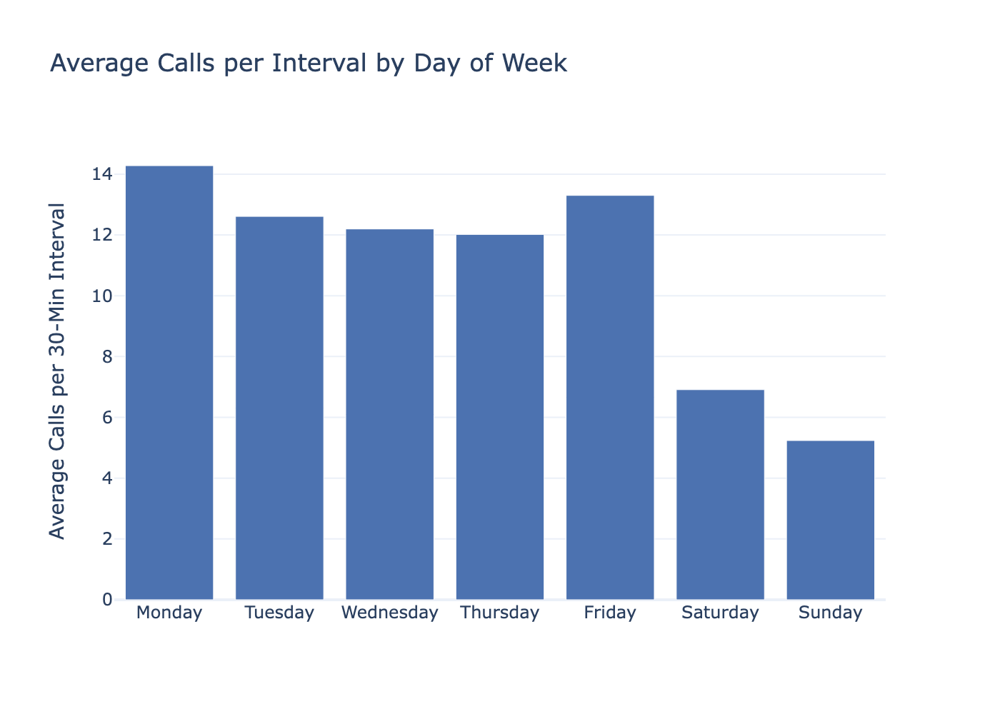 | 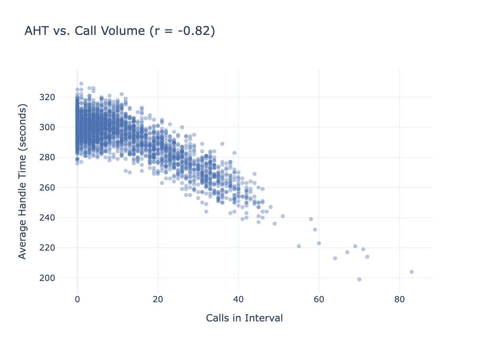 |
| 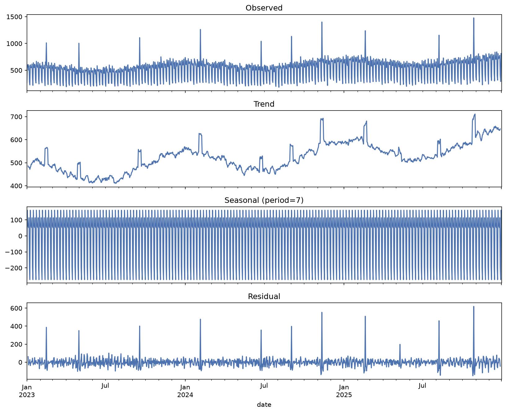 | 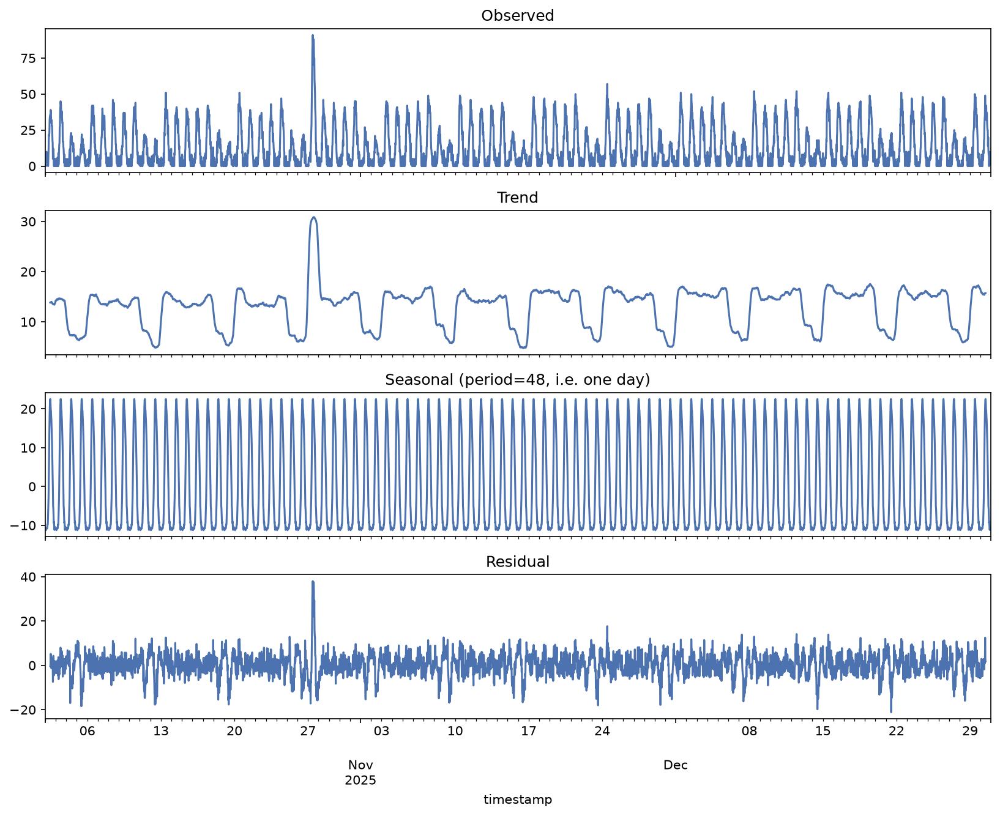 |
| 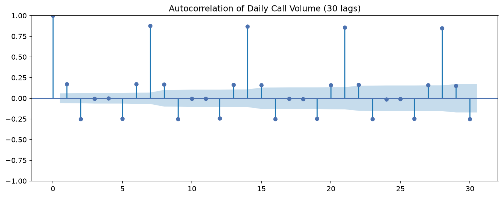 | 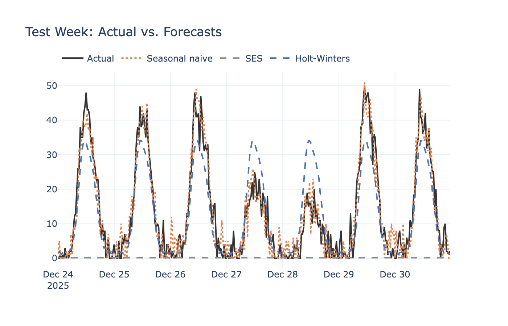 |
| 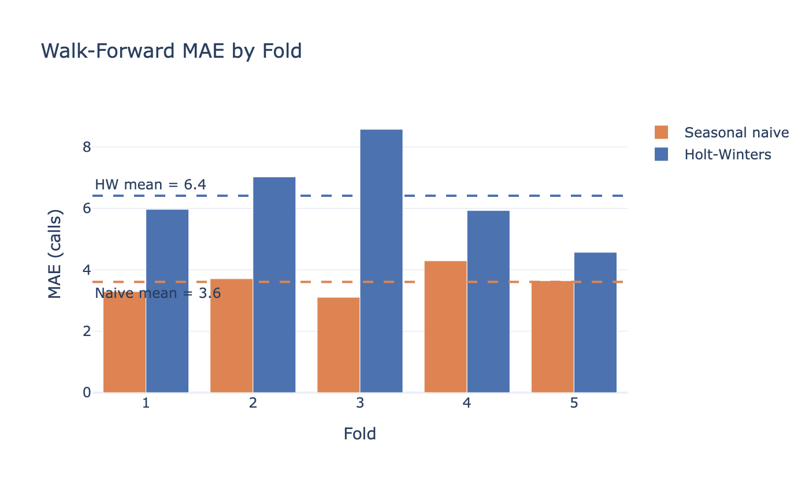 | 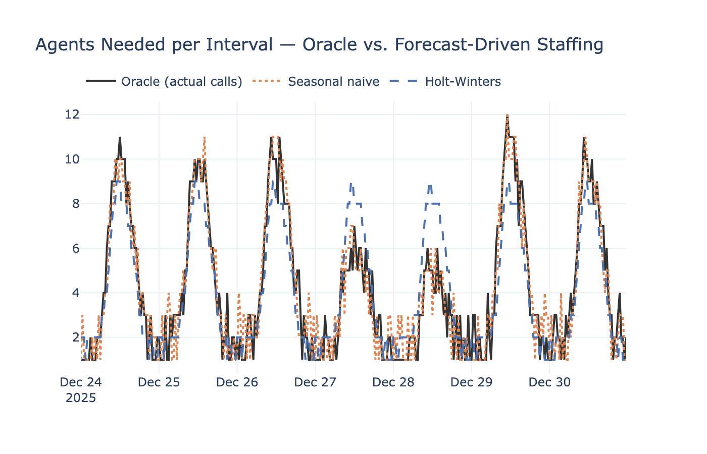 |
